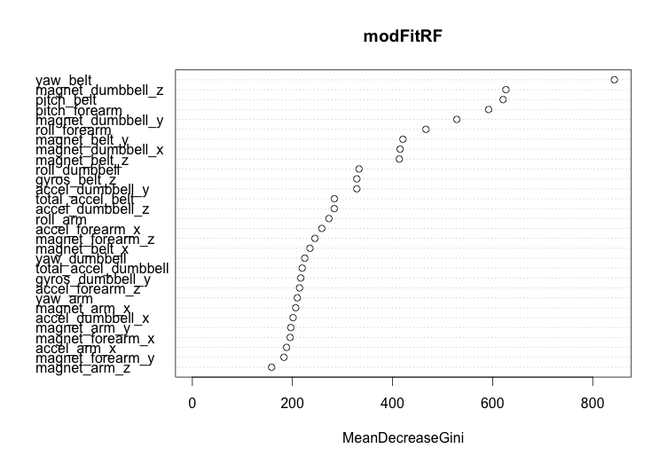

---
"Practical Machine Learning - Project report"
---

# Practical Machine Learning - Project report

### DATA IMPORT

First of all, we load the 2 datasets and exclude records with NA and other variants
```
trainingC0 <- read.csv("pml-training.csv", na.strings=c("", "NA", "NULL","#DIV/0"))
testingC0 <- read.csv("pml-testing.csv", na.strings=c("", "NA", "NULL","#DIV/0"))
```

### DATA CLEANUP

First we remove the columns which have no physical meaning and therefore should be excluded from the model, typically all timestamps, window information and username.
```
trainingC1 <- subset(trainingC0, select=-c(X, user_name, new_window, num_window, raw_timestamp_part_1, raw_timestamp_part_2, cvtd_timestamp))
```

Then remove columns with NA. We reach 153 columns
```
trainingC2 <- trainingC1[, colSums(is.na(trainingC1))==0]
```

They all look nice 53 columns, all numeric except the classe column obviously
head(trainingC2,5)
dim(trainingC2)

Identify if there are near zero variance variables in the remaining set
```
nzv <- nearZeroVar(trainingC2, saveMetrics=TRUE)
nzv
```
We can see that none of them falls into that category so we are keeping all predictors 

Check if some variables are highly correlated (threshold 90%)
```
corMat <- cor(na.omit(trainingC2[sapply(trainingC2, is.numeric)]))
cor_var <- findCorrelation(corMat, cutoff = .90, verbose = FALSE)
trainingC3 <- trainingC2[,-cor_var]
names(trainingC2[c(cor_var)]) 
```
We can observe that 7 variables could be excluded from the dataset:
```
[1] "accel_belt_z"     "roll_belt"        "accel_belt_y"     "accel_belt_x"     "gyros_arm_y"      "gyros_forearm_z" 
[7] "gyros_dumbbell_x"
```

Before we move forward, let's replicate the same filtering/cleaning functions to the test file for later
```
testingC1 <- subset(testingC0, select=-c(X, user_name, new_window, num_window, raw_timestamp_part_1, raw_timestamp_part_2, cvtd_timestamp))
testingC2 <- testingC1[, colSums(is.na(trainingC1))==0] ## using the columns excluded in the training set
testingC3 <- testingC2[,-cor_var] ## removing the highly correlated values
```

Now let's split the set into a training set and a test set
This is addressing cross validation requirements
```
inTrain <- createDataPartition(y=trainingC3$classe, p=0.75, list=FALSE)
trainS <- trainingC3[inTrain,]
testS <- trainingC3[-inTrain,]
```
### MACHINE LEARNING

Now let's try different techniques and check which one is the best, starting with standard tree and then moving to a random forest

### Regression trees
```
modFitTREE <- rpart(classe ~ ., data=trainS, method="class")
print(modFitTREE)
```

Plot
```
plot(modFitTREE, uniform=TRUE, main="Classification Tree")
text(modFitTREE, use.n=TRUE, all=TRUE, cex=.8)
```
We can observe that the tree is very deep. Before attempting any pruning, let's have a look at the results


Apply the tree against our test set
```
predictTREE <- predict(modFitTREE, newdata=testS, type="class")
```

Display the results using the confusion matrix
```
confusionMatrix(predictTREE, testS$classe)
Overall Statistics
                                          
               Accuracy : 0.7335          
                 95% CI : (0.7209, 0.7458)
    No Information Rate : 0.2845          
    P-Value [Acc > NIR] : < 2.2e-16       
                                          
                  Kappa : 0.6626          
 Mcnemar's Test P-Value : < 2.2e-16  
```

**We can observe around 73% accuracy which is not extremely good.**


### Random forest

We would hope that random forest leads to better results than the plain trees 
We follow the same method as before.

```
modFitRF <- randomForest(classe ~ ., data=trainS, method="class")
print(modFitRF$finalModel)
predictRF <- predict(modFitRF, newdata=testS, type="class")
confusionMatrix(predictRF, testS$classe) ## Accuracy around 99.65%
varImp(modFitRF)
varImpPlot(modFitRF)

Overall Statistics
                                         
               Accuracy : 0.9965         
                 95% CI : (0.9945, 0.998)
    No Information Rate : 0.2845         
    P-Value [Acc > NIR] : < 2.2e-16      
                                         
                  Kappa : 0.9956         
 Mcnemar's Test P-Value : NA             


```
**Accuracy reaches 99,65% with random forest showing that this algorithm is largely better than simple trees**

We can also observe the best predictors with varImp
image: 

## Apply to the test set

Now we apply our best algorithm (random forest) to the provided test set for grading:
```
predictTEST <- predict(modFitRF, newdata=testingC3, type="class")
```
All tests are passed succesfully. 